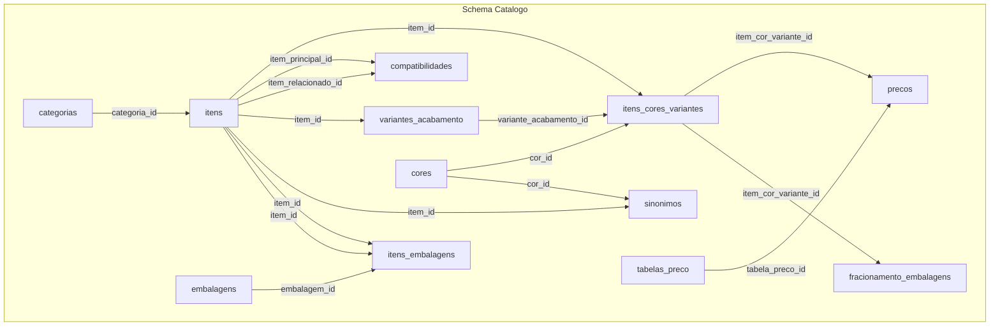

# Análise Completa do Schema Catalogo - SuperCopo Flow

## 1. Visão geral e propósito

O schema **catalogo** é o núcleo de dados do **catálogo de produtos e acessórios** da Super Copo (copos, canecas, tampas, canudos, etc.). Ele armazena itens "lisos" (sem personalização), variações de cor/acabamento, preços progressivos por quantidade, compatibilidades produto-acessório, embalagens para frete e sinônimos para busca em linguagem natural.

**Produção (feb/2025):** 137 itens, 2090 SKUs (itens_cores_variantes), 3850 sinônimos, 300 compatibilidades, 686 preços.

---

## 2. Arquitetura de tabelas

### 2.1 Diagrama de relacionamentos




### 2.2 Tabelas por camada


| Camada           | Tabelas                                                  | Papel                                                          |
| ---------------- | -------------------------------------------------------- | -------------------------------------------------------------- |
| **Mestre**       | `categorias`, `cores`, `embalagens`, `tabelas_preco`     | Catálogos globais reutilizáveis                                |
| **Núcleo**       | `itens`, `itens_cores_variantes`, `variantes_acabamento` | Produtos, SKUs vendáveis e acabamentos                         |
| **Precificação** | `precos`                                                 | Preços por SKU + tabela + vigência + faixa de quantidade       |
| **Logística**    | `itens_embalagens`, `fracionamento_embalagens`           | Embalagens por item e regras de fracionamento                  |
| **Inteligência** | `compatibilidades`, `sinonimos`                          | Compatibilidade produto-acessório e busca em linguagem natural |


---

## 3. Modelo de dados detalhado

### 3.1 Fluxo do SKU vendável

Um **SKU vendável** é a combinação `item + cor + variante (opcional)`:

```
itens (produto base) 
  → itens_cores_variantes (SKU: item + cor + variante_acabamento)
    → precos (preço por tabela, vigência, quantidade)
    → fracionamento_embalagens (regras de embalagem por SKU)
```

- **itens:** Produtos e acessórios; `tipo_item` = `produto` | `acessorio`; `linha_produto` = Premium, Light, Fit, Bio, Fosco, Metalizado.
- **itens_cores_variantes:** SKUs únicos; `sku_completo` (ex: MINI-TWIST-AZUL-NEON-BORDA-OURO); `codigo_estoque` (ERP).
- **variantes_acabamento:** Fosco, Metalizado, Borda Metalizada, etc.; preço por produto (`item_id`), suporta metadata para acabamentos compostos.

### 3.2 Precificação

- **tabelas_preco:** varejo, atacado, promocional, especial.
- **precos:** liga `item_cor_variante_id` ou `item_id` (fallback) a `tabela_preco_id`; faixas por quantidade (`quantidade_minima`, `quantidade_maxima`); vigência; suporta `preco_promocional`.

### 3.3 Compatibilidade produto-acessório

- **compatibilidades:** relaciona `item_principal_id` ↔ `item_relacionado_id`; `tipo_compatibilidade` = encaixa, pode_junto, reposicao, incompativel; `bidirecional` para relações simétricas.

### 3.4 Sinônimos e busca

- **sinonimos:** mapeia `termo_sinonimo` (ex: "long", "rosa bebê") para `item_id` e/ou `cor_id`; `tipo_sinonimo` = item, cor, generico; `prioridade` para desambiguação.

### 3.5 Embalagens e frete

- **embalagens:** caixas com capacidade, peso, dimensões.
- **itens_embalagens:** item × embalagem por faixa (`qtd_min`, `qtd_max`).
- **fracionamento_embalagens:** regras por SKU (`unidades_por_caixa`, `multiplo_minimo_venda`, etc.).

---

## 4. Views


| View                        | Propósito                                                |
| --------------------------- | -------------------------------------------------------- |
| `v_catalogo_completo`       | Item + categoria + SKU + cor + variante + URLs de imagem |
| `v_itens_com_preco_vigente` | Itens ativos com preço vigente na tabela "Atacado Liso"  |


---

## 5. RPCs principais (25+ funções)

### 5.1 Busca e descoberta

- **buscar_itens_por_termo** – Busca por linguagem natural (sinônimos + nome); wrappers em `public` para REST.
- **obter_combinacoes_disponiveis** – Lista cores/variantes e preços por item (por slug ou UUID).
- **obter_ficha_tecnica_produto** – Medidas, embalagem, especificações.
- **listar_acessorios_compativeis** – Acessórios compatíveis (obrigatórios e opcionais).
- **validar_compatibilidade_combo** – Valida combo produto + acessório.

### 5.2 Precificação

- **obter_preco_por_quantidade** – Preço por produto + quantidade + cor; usada por fluxo gamificado e Edge Function.
- **obter_preco_vigente** / **obter_preco_vigente_por_item** – Preço vigente por SKU ou item.
- **consultar_acabamento_adicional** – Preço de acabamento extra (ex: borda metalizada).

### 5.3 Embalagem e frete

- **calcular_caixas_necessarias** – Cálculo de caixas por quantidade.
- **montar_payload_cotacao_frete** – Payload para webhook de cotação de frete.
- **obter_regras_fracionamento**, **obter_dados_embalagem_produto** – Regras de embalagem.

### 5.4 Wrappers públicos

As funções principais existem em `catalogo.*` e são expostas via `public.*` para uso via REST/PostgREST.

---

## 6. Integrações (frontend e backend)

### 6.1 Frontend

- [src/services/gamifiedService.ts](src/services/gamifiedService.ts): `consultarPrecoProduto()` chama a Edge Function `consulta-preco-public`.
- Edge Function `consulta-preco-public` → RPC `public.obter_preco_por_quantidade` para eco_label_400ml, eco_label_500ml, eco_label_600ml.

### 6.2 Agente IA (WhatsApp)

O [PROMPT_AGENTE_IA_CATALOGO_BLUEPRINT.md](docs/atendimentos/PROMPT_AGENTE_IA_CATALOGO_BLUEPRINT.md) define o fluxo:

1. `buscar_itens_por_termo` → item_id, SKU
2. `obter_ficha_tecnica_produto` → medidas, embalagem
3. `obter_combinacoes_disponiveis` → preços, cores, codigo_estoque
4. `consulta_estoque_erp` (externa)
5. `listar_acessorios_compativeis` → acessórios opcionais/obrigatórios
6. `consultar_acabamento_adicional` → borda metalizada, hotstamp
7. `validar_compatibilidade_combo` → validação de combo
8. `buscar_caixas_embalagens` → regras de fracionamento

### 6.3 Scripts e automações

- `scripts/catalogo/` – Testes e manutenção (cotação frete, eco_label, validações).
- `scripts/growth/diagnostico_lead_e_preco.py` – Diagnóstico de preço via RPC.
- `scripts/mapear_itens_checkout_para_api.py` – Mapeamento de itens para API.

---

## 7. Segurança (RLS)

- **anon:** SELECT em itens/cores/categorias ativos, precos vigentes, sinônimos ativos, compatibilidades ativas.
- **service_role:** acesso total às tabelas.
- Acesso direto às tabelas do schema `catalogo` é via RPCs (SECURITY DEFINER).

---

## 8. Dependências técnicas

- **pg_trgm:** busca fuzzy em sinônimos e nomes.
- **Supabase (PostgREST):** exposição via `public.*`.
- Sem FKs de outros schemas apontando para `catalogo`; é um módulo isolado.

---

## 9. O que o schema permite extrair


| Capacidade                        | Fonte                                                                 |
| --------------------------------- | --------------------------------------------------------------------- |
| Busca por termo natural           | `sinonimos` + `buscar_itens_por_termo`                                |
| Preço por quantidade/faixa        | `precos` + `obter_preco_por_quantidade`                               |
| Listagem de cores/variantes       | `itens_cores_variantes` + `obter_combinacoes_disponiveis`             |
| Compatibilidade produto–acessório | `compatibilidades` + `listar_acessorios_compativeis`                  |
| Dimensões e peso para frete       | `itens`, `embalagens`, `itens_embalagens`, `fracionamento_embalagens` |
| Payload de cotação de frete       | RPC `montar_payload_cotacao_frete`                                    |
| Imagens e diretórios              | `url_imagem`, `url_diretorio` em itens e itens_cores_variantes        |
| Integração ERP                    | `erp_id`, `codigo_estoque`, `sku_base`                                |


---

## 10. Pontos de atenção

- **precos:** aceita `item_cor_variante_id` e `item_id`; lógica de fallback nas RPCs de preço.
- **fracionamento_embalagens:** usa `item_cor_variante_id` e `item_id` opcional.
- **buscar_itens_por_termo:** várias migrações de ajuste; versão atual prioriza PRODUTO+COR.
- **RLS:** anon não tem INSERT/UPDATE/DELETE; alterações via service_role ou migrations.

